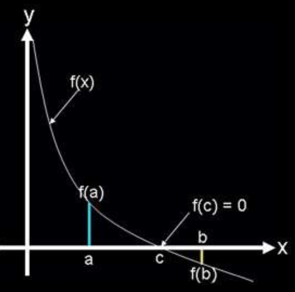

# Root Finding

## Bisection Method
The **Intermediate Value Theorem** says that if _f(x)_ is a continuous function between a and b, and
$sign(f(a)) \neq sign(f(b))$, then there must be a _c_, such that $a < c < b$ and $f(c) = 0$. This is illustrated
in Fig. below

[](figure1.png) 

The bisection method uses the intermediate value theorem iteratively to find roots. Let $f(x)$ be
a continuous function, and a and b be real scalar values such that $a < b$. Assume, without loss of
generality, that $f (a) > 0$ and $f (b) < 0$. Then, by the intermediate value theorem, there must be a root
in the open interval $(a, b)$. Now let $m = \frac{b+a}{2}$ be the midpoint between and a and b. If $f(m) = 0$ or
is close enough, then m is a root. If $f(m) > 0$, then m is an improvement on the left bound, _a_, and it
is guaranteed that there is a root in the open interval $(m, b)$. If $f(m) < 0$, then m is an improvement
on the right bound, _b_, it is guaranteed that there is a root in the open interval $(a, m)$.
The process of updating _a_ and _b_ is repeated until the error is acceptably low.

---
**Algorithm of Bisection Method used here**
1. Input two values of x that embrace the interval where the root is expected
2. Calculate corresponding values for y
3. Check for the sign difference between y-values.
4. If the signs are not opposite, stop
5. Calculate the value of x in the half of the interval
6. Check for the sign difference between the y-values first half interval 
7. If the signs are opposite, let x1 and x2 be the limits of the first half interval
8. Else let x1 and x2 be the limits of the second half interval
9. If values of y approaches zero, print the x-value and stop
10. Else repeat steps from 5 to 10.

- [Code](https://github.com/nishantaMishra/computational-physics-in-python/blob/main/BisectionMethod/bisection.py)
```python
# Find root of 2*x**2 - 5*x + 3 = 0 using bisection method
import sys

x1 = float(input('Enter value of x1: '))
x2 = float(input('Enter value of x2: '))
y1 = 2*x1**2 - 5*x1 + 3
y2 = 2*x2**2 - 5*x2 + 3

if y1*y2 < 0:
    print('The root is not within the given interval')
    sys.exit()
for bisection in range(1,101):
    xh = (x1 + x2)/2
    yh = 2*xh**2 - 5*xh + 3
    y1 = 2*x1**2 - 5*x1 + 3

    if abs(y1) < 1.0E-6:
        break
    elif y1*yh < 0: #if the root is in first half interval.
        x2 = xh      #then make x2 =xh
    else:
        x1 = xh
print('The root: %0.5f' %x1)
print('The number of bisections:%d ' %bisection)
```

Note: Bisection method is very robust in one dimensions albeit slower. If initial guess is close enough to the root and the function is smooth enough then Newton-Raphson method converges much faster. 
