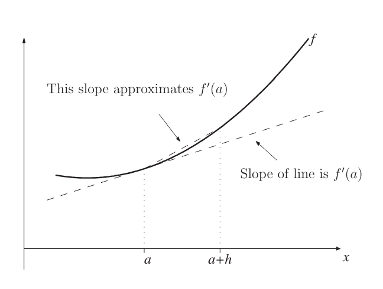

# Differentiation

This repository contains codes for numerically approximating derivatives of a function.

## Finite Difference Method.

While evaluating derivatives the aim is to approximate the slope of a curve $f$ at a particular point $x = a$ in terms of $f(a)$ and
the value of $f$ at a nearby point where $x = a+h$. The shorter broken line Figure 1 may be thought
of as giving a reasonable approximation to the required slope (shown by the longer broken line), if h
is small enough.

[](figure1.png) 

So, we might approximate 
```math
f'(a) \approx slope = \frac{\text{difference in the y-values}}{\text{difference in the x-values}} = \frac{f(a+h) - f(a)}{h}   \tag{$1$} 
```

this equation 1 is called **forward difference approximation** to the derivative of $f$. 

For obtaining the equation 1 we considered a point on right of $a$, if we rather consider a point to the left of $a$ then the equation we obtain looks like following, 
```math
f'(a) \approx \frac{f(a) - f(a - h)}{h}   \tag{$2$}
```
This equation 2 is called the **backward difference approximation** to $f'(a)$

Also, we can assume points $a-h$ and $a+h$ on either side of the point $a$ and write the expression of differentiation as 
```math
f'(a) \approx \frac{\text{difference in the y-values}}{\text{difference in the x-values}} = \frac{f(x+h) - f(x - h)}{2h}    \tag{$1$} 
```
This is called a **central difference** approximation to the derivative of $f$.

### codes
---
- [Forward difference approximatin](differentiation1.py)
- [Backward difference approximatin](differentiation2.py)
- [Central difference approximatin](differentiation3.py) 
- [Graph of derivative functions](differentiation4.py)


