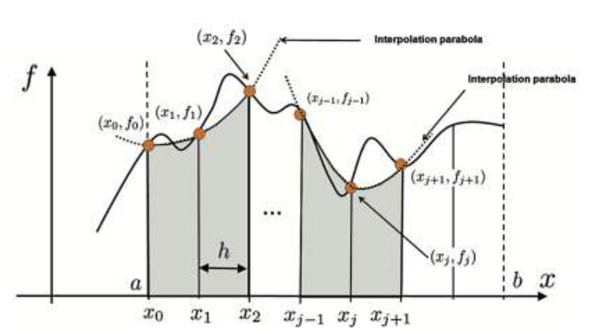

# Numerical integration

## Simpson's rule

Simpson's rules are the methods of numerical integration proposed by Thomas Simpson. There are two rules given by Thomas Simpson, called Simpson's 1/3 rule and Simpson's 3/8 rule. Both these rules provide more accurate approximations compared to the Trapezoidal Rule by using parabolic or cubic interpolations instead of linear ones.

### Simpson's 1/3 Rule

Consider two consecutive subintervals, $[x_{i-1}, x_i] \text{ and } [x_i, x_{i+1}]$. Simpson's 1/3 rule approximates the area under the curve over these two sub-intervals by fitting a quadratic polynomial through the points $ (x_{i-1}, f(x_{i-1})), (x_i, f(x_i)), \text{ and } (x_{i+1}, f(x_{i+1})), which is a unique polynomial, and then integrates the quadratic exactly. 

[](figure1.png) 

For an integral $\int_a^b f(x) dx$, where $b-a = 2h$, Simpson's 1/3 rule is, 

```math
\int_a^b f\left(x\right) dx \approx \frac{h}{3} \left[  f\left(a\right) + 4f\left(\frac{a+b}{2}\right) + f\left(b\right) \right]
```
where $h = \frac{b-a}{n} \text{ and } x_i = a + ih$

**WARNING!**: Note that to use Simpson’s rule, you must have an even number of intervals and,
therefore, an odd number of grid points.

### Simpson's 3/8 Rule 
Simpson's 3/8 rule is a variant of Simpson's 1/3 rule that uses cubic polynomials for interpolating. The general formula for it is

```math
\int_a^b f\left(x\right) dx \approx \frac{3h}{8} \left[ f \left( a \right) + 3f \left(a+h \right) + 3f \left(a+2h \right) + f\left(b\right) \right]
```

### Code 
- [Simpson's 1/3 Rule](simpson1-3rule.py)
- [Double integration](simpsonDoubleIntegration.py) using simpson's 1/3 rule.
- [Simpson's 3/8 Rule](simpson3-8rule.py)

