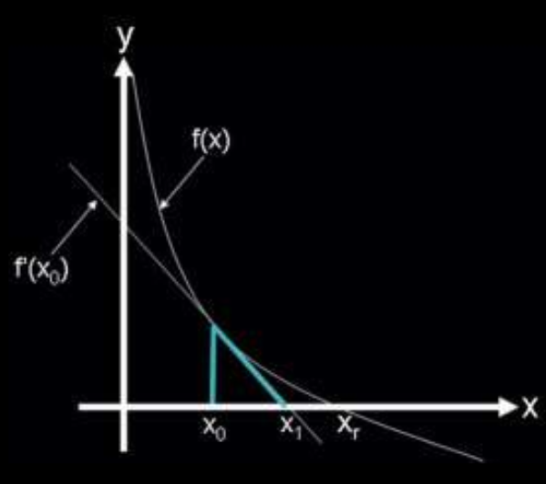

# Root Finding

## Newton-Raphson Method

Let $f(x)$ be a smooth function, and $x_r$ be an unknown root of $f(x)$. Assume that $x_0$ is a guess for
$x_r$ . Unless $x_0$ is a very lucky guess, $f(x_0)$ will not be a root. Given this scenario, we want to find an
$x_1$ that is an improvement on $x_0$ (i.e., closer to $x_r$ than $x_0$ ). If we assume that $x_0$ is “close enough”
to $x_r$ , then we can improve upon it by taking the linear approximation of $f(x)$ around $x_0$ , which is
a line, and finding the intersection of this line with the x-axis. Written out, the linear approximation
of $f(x)$ around $x_0$ is $f(x) \approx f (x_0 ) + f'(x_0 )(x − x_0 ). Using this approximation, we find $x_1$ such that
$f(x_1) = 0$. Plugging these values into the linear approximation results in the following equation:
```math
x_1 = x_0 - \frac{f(x_0)}{f'(x_0)}
```
[](figure1.png) 

Written generally, a Newton step computes an improved guess, xi , using a previous guess, xi−1 ,
and is given by the equation
```math
x_i = x_{i-1} - \frac{g(x_{i-1})}{g'(x_{i-1})}
```
---
### Algorithm used here
Defining a Newton Raphson Function that takes four parameters
1. f: The function whose root is to be found.
2. df: The derivative of the function f.
3. x0: The initial guess for the root.
4. tol: The tolerance level for the root approximation.

**NRF Function Definition:**
- Print Initial Guess: The function prints the initial guess x0.
- Root Check: if the absolute value of f(x0) is less than the tolerance tol. prints value of x0 as the root and returns it.
- Recursion: If the root check fails (i.e., abs(f(x0)) is not less than tol), the function recursively calls itself with updated parameters.
---
- [Code](https://github.com/nishantaMishra/computational-physics-in-python/blob/main/newtonRaphsonMethod/newtonRaphson.py)
