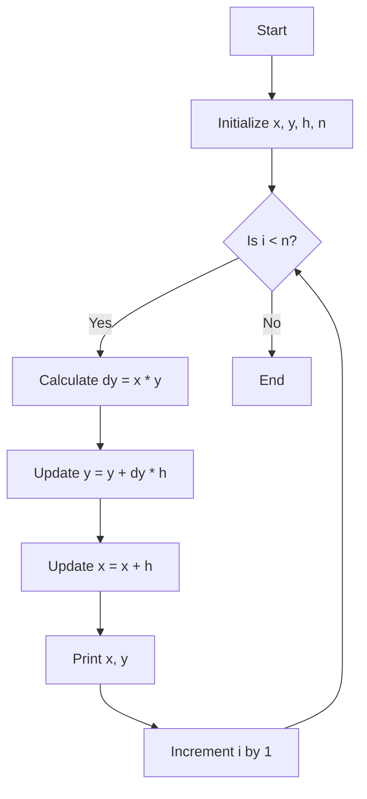

Euler's Method is a straightforward numerical technique for solving ordinary differential equations (ODEs) that are difficult or impossible to solve analytically. It's particularly useful when you have an initial value problem, where the goal is to find the value of a function given its derivative and an initial condition.

### What is Euler's Method?
Euler's Method approximates the solution to an ODE by stepping forward in small increments from the initial value. The basic idea is to use the slope (derivative) of the function at a known point to estimate the value of the function at the next point.


Consider an initial value problem of the form:

```math
\frac{dy}{dx} = f(x,y), \quad y(x_0)=y_0
```
​
Here, $y$ is the unknown function of $x$, and $f(x,y)$ is a given function that defines the derivative of y with respect to x. The goal is to find  y over some interval, starting from the initial condition $y(x_0) = y_0$ .


### Steps of Euler's Method:
Choose a step size h:
The interval [x_0 ,x_n ] is divided into smaller sub-intervals of width h. The step size h determines how much you move along the x-axis in each iteration.


Starting Point:

Begin at the initial condition 
(
𝑥
0
,
𝑦
0
)
(x 
0
​
 ,y 
0
​
 ).
Iterative Process:

For each step 
𝑖
i (from 0 to 
𝑛
−
1
n−1):
𝑦
𝑖
+
1
=
𝑦
𝑖
+
ℎ
⋅
𝑓
(
𝑥
𝑖
,
𝑦
𝑖
)
y 
i+1
​
 =y 
i
​
 +h⋅f(x 
i
​
 ,y 
i
​
 )
𝑥
𝑖
+
1
=
𝑥
𝑖
+
ℎ
x 
i+1
​
 =x 
i
​
 +h
This process is repeated until the desired value of 
𝑥
x is reached.
Visualization:
Imagine starting at a point 
(
𝑥
0
,
𝑦
0
)
(x 
0
​
 ,y 
0
​
 ) on the curve 
𝑦
(
𝑥
)
y(x).
The slope of the tangent to the curve at this point is given by 
𝑓
(
𝑥
0
,
𝑦
0
)
f(x 
0
​
 ,y 
0
​
 ).
Euler's Method approximates the curve by moving in the direction of this slope for a small distance 
ℎ
h, leading to a new point 
(
𝑥
1
,
𝑦
1
)
(x 
1
​
 ,y 
1
​
 ).
This process is repeated, moving from point to point, to trace out an approximation to the curve.
Example
Suppose you want to solve the differential equation:

𝑑
𝑦
𝑑
𝑥
=
𝑥
𝑦
dx
dy
​
 =xy
with the initial condition 
𝑦
(
0
)
=
1
y(0)=1, over the interval 
[
0
,
2
]
[0,2].

Applying Euler's Method:
Given:

𝑓
(
𝑥
,
𝑦
)
=
𝑥
𝑦
f(x,y)=xy
Initial condition: 
(
𝑥
0
,
𝑦
0
)
=
(
0
,
1
)
(x 
0
​
 ,y 
0
​
 )=(0,1)
Step size: 
ℎ
=
0.1
h=0.1
Iteration 1:

𝑦
1
=
𝑦
0
+
ℎ
⋅
𝑓
(
𝑥
0
,
𝑦
0
)
=
1
+
0.1
⋅
(
0
×
1
)
=
1
y 
1
​
 =y 
0
​
 +h⋅f(x 
0
​
 ,y 
0
​
 )=1+0.1⋅(0×1)=1
𝑥
1
=
𝑥
0
+
ℎ
=
0
+
0.1
=
0.1
x 
1
​
 =x 
0
​
 +h=0+0.1=0.1
Iteration 2:

𝑦
2
=
𝑦
1
+
ℎ
⋅
𝑓
(
𝑥
1
,
𝑦
1
)
=
1
+
0.1
⋅
(
0.1
×
1
)
=
1.01
y 
2
​
 =y 
1
​
 +h⋅f(x 
1
​
 ,y 
1
​
 )=1+0.1⋅(0.1×1)=1.01
𝑥
2
=
𝑥
1
+
ℎ
=
0.1
+
0.1
=
0.2
x 
2
​
 =x 
1
​
 +h=0.1+0.1=0.2
Continue...

Advantages and Limitations
Advantages:

Simple to implement: Euler's method is easy to understand and implement computationally.
Quick computation: For small problems or problems requiring low accuracy, Euler's method can be very fast.
Limitations:

Accuracy: Euler's method is a first-order method, meaning its error is proportional to the step size 
ℎ
h. The smaller the step size, the more accurate the method, but it also requires more computational steps.
Stability: For some differential equations, especially stiff ones, Euler's method can become unstable unless the step size is very small.
Summary
Euler's Method is a fundamental numerical technique for approximating solutions to differential equations. It works by taking small steps along the curve, using the slope at each step to estimate the next point. While it's simple and easy to use, it's best suited for problems where a rough approximation is sufficient, or as a stepping stone to more advanced methods.




```mermaid
graph TD
    A[Start: Given ODE dy/dx = f(x, y) and initial condition y(x0) = y0] --> B[Choose step size h]
    B --> C[Set initial values: x = x0, y = y0]
    C --> D[Calculate slope: dy = f(x, y)]
    D --> E[Update y: y = y + h * dy]
    E --> F[Update x: x = x + h]
    F --> G{Is x < xn?}
    G --> |Yes| D
    G --> |No| H[End: Solution approximated over the interval [x0, xn]]
```
