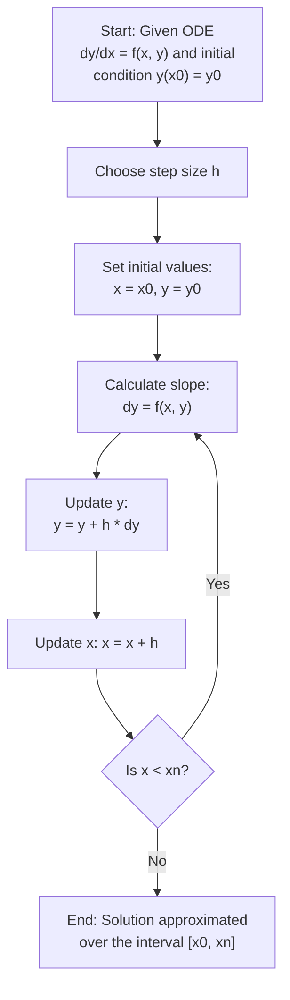

Euler's Method is a straightforward numerical technique for solving ordinary differential equations (ODEs) that are difficult or impossible to solve analytically. It's particularly useful when you have an initial value problem, where the goal is to find the value of a function given its derivative and an initial condition.

### What is Euler's Method?
Euler's Method approximates the solution to an ODE by stepping forward in small increments from the initial value. The basic idea is to use the slope (derivative) of the function at a known point to estimate the value of the function at the next point.


Consider an initial value problem of the form:

```math
\frac{dy}{dx} = f(x,y), \quad y(x_0)=y_0
```
​
Here, $y$ is the unknown function of $x$, and $f(x,y)$ is a given function that defines the derivative of y with respect to x. The goal is to find  y over some interval, starting from the initial condition $y(x_0) = y_0$ .


### Steps of Euler's Method:


## Example
Suppose you want to solve the differential equation:

```math
\frac{dx}{dy} = xy
``` 

with the initial condition $y(0)=1$, over the interval $[0,2]$.

Applying Euler's Method:

Given:
```math
f(x,y)=xy
```

Initial condition: $(x_0 ,y_0) = (0,1)$
Step size: $ℎ = 0.1$

Iteration 1:
```math
y_1 = y_0 + h \cdot f(x_0, y_0) = 1 + 0.1 \cdot (0 \times 1) = 1
```

```math
x_1 = x_0 + h = 0 + 0.1 = 0.1
```

Iteration 2:

```math
y_2 = y_1 + h \cdot f(x_1, y_1) = 1 + 0.1 \cdot (0.1 \times 1) = 1.01
```

```math
x_2 = x_1 + h = 0.1 + 0.1 = 0.2
```

Continue... till convergence


<div style="display: flex;">
  <div style="flex: 50%; padding-right: 10px;">
    <!-- Left column content -->
    ### Column 1
    This is the content for the first column.
  </div>
  <div style="flex: 50%; padding-left: 10px;">
    <!-- Right column content -->
    ### Column 2
    This is the content for the second column.
  </div>
</div>

<table border="0">
 <tr>
    <td><b style="font-size:30px">Title</b></td>
    <td><b style="font-size:30px">Title 2</b></td>
 </tr>
 <tr>
    <td>Lorem ipsum ...</td>
    <td>Lorem ipsum ...</td>
 </tr>
</table>


### Limitations of Euler's Method:
1. *Accuracy*: Euler's method is a first-order method, meaning its error is proportional to the step size $h$. The smaller the step size, the more accurate the method, but it also requires more computational steps.
2. *Stability*: For some differential equations, especially stiff ones, Euler's method can become unstable unless the step size is very small.


